<div align="center">


# OptiFin

**Votre Jellyfin, en version cinéma.**

Client [Jellyfin](https://jellyfin.org) pour iPhone et Android : une interface immersive dans l'esprit d'Infuse,
et un lecteur hybride qui choisit tout seul le meilleur moteur pour chaque fichier.

[](https://github.com/AL1X0/OptiFin/actions/workflows/ci.yml)
[](https://github.com/AL1X0/OptiFin/releases/latest)


<a href="docs/media/optifin-demo.mp4">
  
</a>

▶ [**Voir la vidéo de démo**](docs/media/optifin-demo.mp4) (25 s, 1080p)

</div>

---

## Aperçu

<table>
  <tr>
    <td align="center" valign="top" width="33%">
      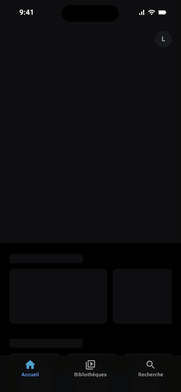<br />
      <sub>Accueil, fiches, séries, bibliothèques, recherche</sub>
    </td>
    <td align="center" valign="top">
      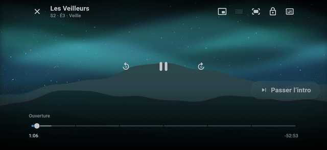<br />
      <sub>Lecteur : « Passer l'intro », moteur de lecture, épisode suivant</sub>
    </td>
  </tr>
</table>

| Accueil | Fiche film | Distribution | Série |
|:---:|:---:|:---:|:---:|
| 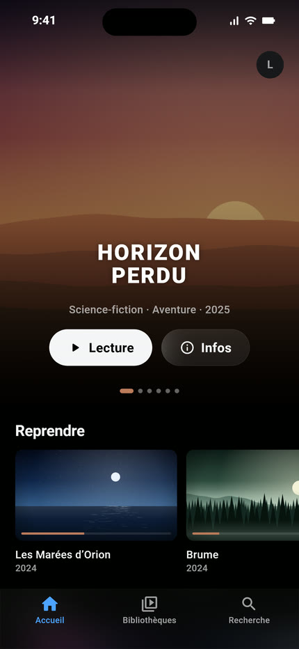 | 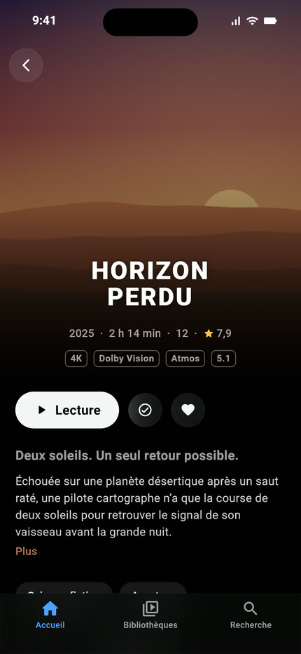 | 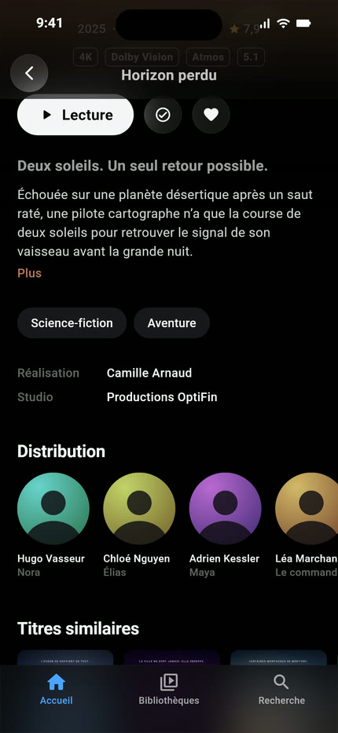 | 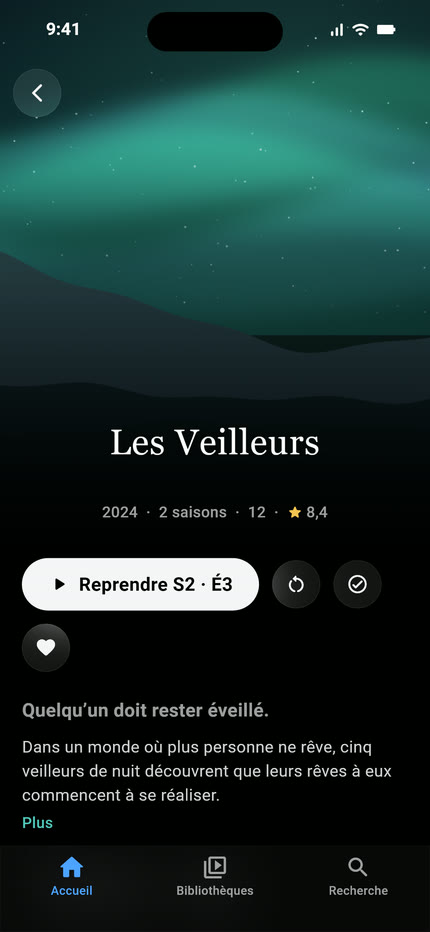 |
| **Épisodes** | **Rangées** | **Bibliothèque** | **Recherche** |
| 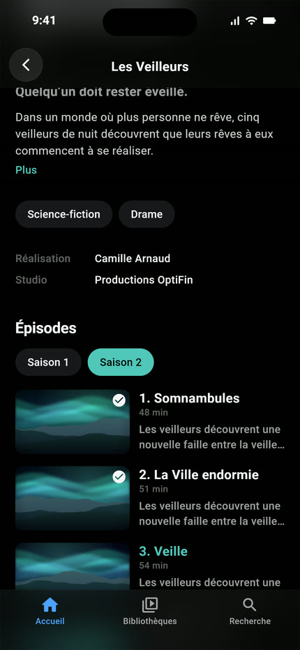 | 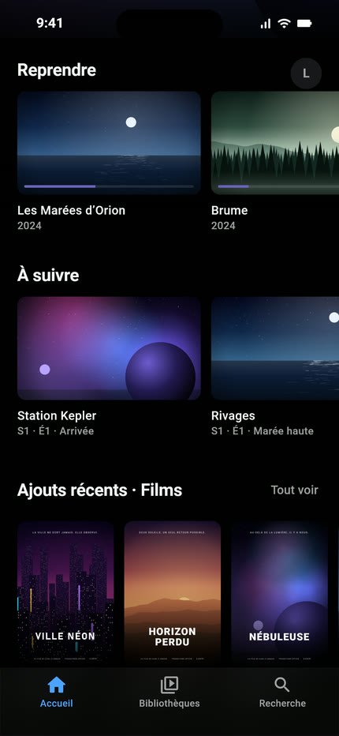 | 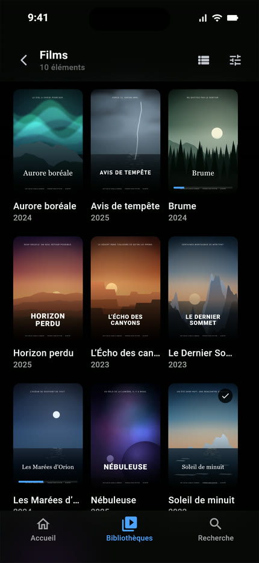 | 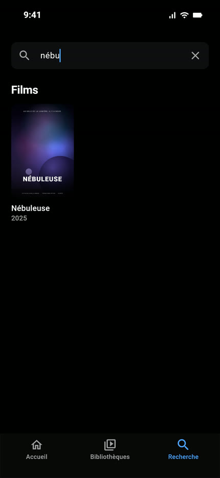 |

<p align="center">
  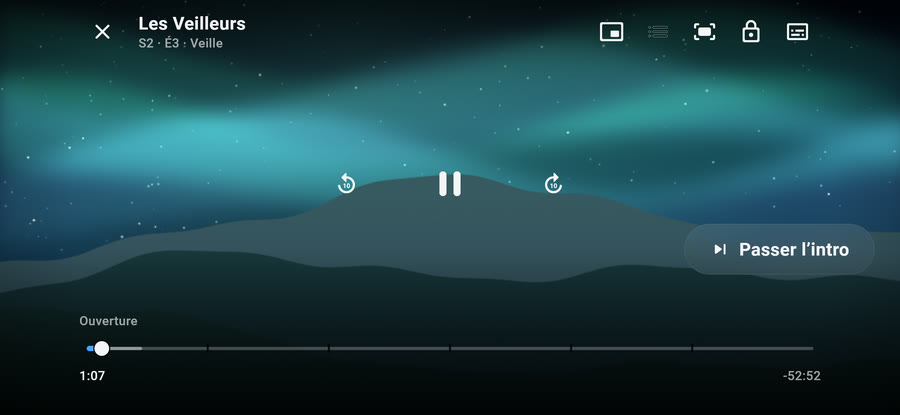
  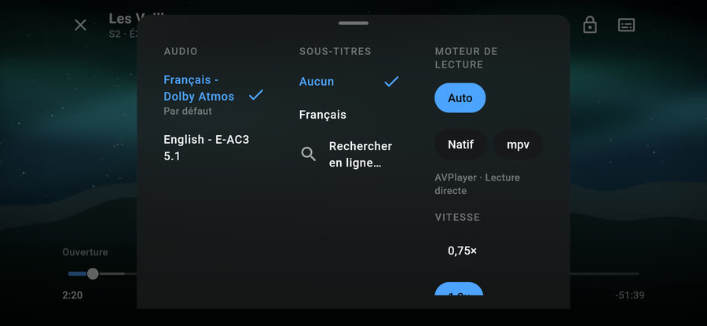
  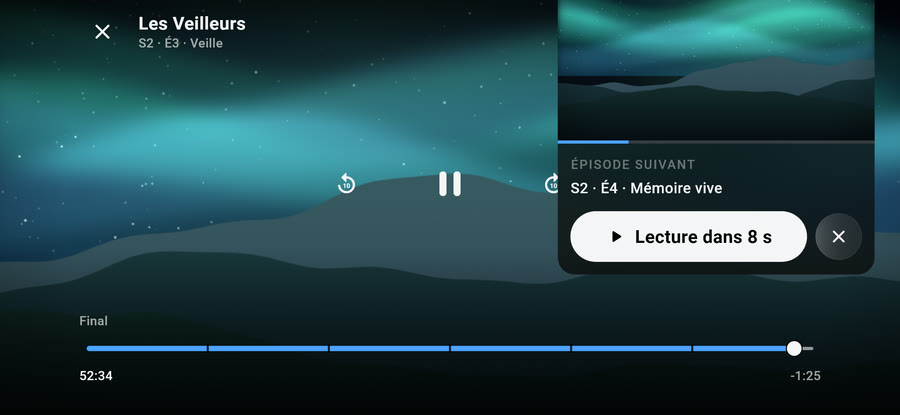
</p>

<sub>Captures réalisées avec l'app réelle sur une bibliothèque de démonstration fictive (titres inventés, illustrations générées par code).</sub>

## Ce qui rend OptiFin différent

### Un lecteur hybride qui décide pour vous

Avant chaque lecture, OptiFin analyse le fichier (conteneur, codecs, HDR, profil Dolby Vision, pistes audio,
format des sous-titres) et les capacités réelles de votre appareil, puis choisit :

| Situation | Moteur | Pourquoi |
|---|---|---|
| Dolby Vision, HDR10, HLG | **AVPlayer** (iOS) / **Media3** (Android) | Rendu HDR natif, économie de batterie ; le serveur réemballe le fichier sans ré-encoder si besoin |
| Fichier lisible tel quel | Lecteur natif | Démarrage le plus rapide, Picture-in-Picture, AirPlay |
| MKV, DTS, TrueHD, sous-titres ASS / PGS, codecs rares | **mpv** (libmpv) | Lit presque tout, sous-titres stylés fidèles |
| Débit trop élevé pour le réseau | Transcodage serveur | En dernier recours seulement |

Si un moteur échoue au démarrage, OptiFin **bascule automatiquement** sur le suivant. Choisir une piste que le
lecteur courant ne sait pas rendre (des PGS sur AVPlayer, par exemple) change de moteur à la position exacte,
sans rien demander. Le choix reste modifiable dans les réglages ou pendant la lecture.
La logique est testée sur une [matrice de 16 fichiers types × 5 appareils](docs/TEST_MATRIX.md).

### Une interface qui donne envie d'appuyer sur Lecture

- Carrousel plein écran avec les logos des titres, couleur d'accent tirée de l'illustration affichée.
- Fiches immersives : backdrop en parallaxe, badges 4K · HDR · Dolby Vision · Atmos, distribution, titres similaires.
- Animations sobres (≤ 300 ms), respect de « Réduire les animations », mode sombre pensé pour l'OLED.

## Fonctionnalités

**Bibliothèques** : accueil (Reprendre, À suivre, ajouts récents, favoris), grilles avec tri et filtres, index
alphabétique, recherche instantanée, pages personne, genre et studio, multi-serveurs et multi-comptes, Quick Connect.

**Lecture** :
- reprise synchronisée avec le serveur ;
- choix de la qualité en Wi-Fi et en cellulaire ;
- langues préférées ;
- sous-titres stylés, avec décalage audio et sous-titres ;
- recherche de sous-titres en ligne, via le serveur ;
- aperçus trickplay et chapitres ;
- « Passer l'intro » et épisode suivant avec compte à rebours ;
- Picture-in-Picture, AirPlay ;
- gestes (luminosité, volume, ±10 s) et verrouillage de l'écran ;
- mode debug avec journaux copiables.

**Hors connexion** : téléchargement des films, épisodes ou saisons entières (fichier d’origine, en arrière-plan,
pause et reprise, Wi-Fi uniquement au choix), onglet « Téléchargements » pour les gérer, lecture sans réseau.

**En préparation** : musique (lecteur audio, paroles), Live TV, SyncPlay,
Chromecast et contrôle à distance.

## Installer

**iPhone (SideStore)** : ajoutez la source ci-dessous dans SideStore (Sources › +). Chaque modification publie
une nouvelle version, proposée en mise à jour ; le bundle ID `app.optifin.optifin` ne change jamais.

```
https://raw.githubusercontent.com/AL1X0/OptiFin/sidestore/source.json
```

**Android** : téléchargez `OptiFin-android-arm64-v8a.apk` dans la [dernière Release](https://github.com/AL1X0/OptiFin/releases/latest).

Il vous faut un serveur Jellyfin 10.9 ou plus récent (10.10+ recommandé pour les segments « Passer l'intro »).

## Développement

```bash
flutter pub get
dart run build_runner build -d   # Drift
flutter analyze && flutter test
```

Régénérer le client API (après mise à jour de la spec OpenAPI) :

```bash
cd packages/jellyfin_api
dart run tool/prepare_spec.dart && dart run swagger_parser && dart run build_runner build -d
```

Régénérer la vidéo de démo et les captures du README (app réelle, bibliothèque fictive, musique synthétisée ;
nécessite Node et ffmpeg) :

```bash
bash demo/make_demo.sh
```

Documentation : [architecture](docs/ARCHITECTURE.md) · [design system](docs/DESIGN_SYSTEM.md) ·
[décisions](docs/DECISIONS.md) · [matrice des moteurs](docs/TEST_MATRIX.md).

La CI (`.github/workflows/ci.yml`) analyse et teste chaque modification, construit l'APK et l'IPA (non signée),
puis publie la Release et la source SideStore.
