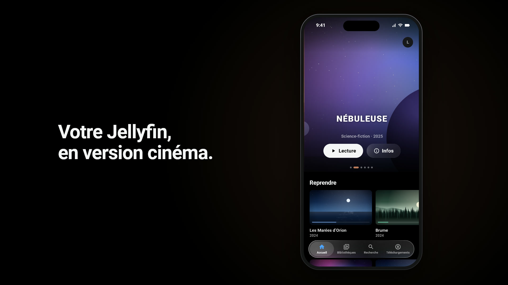
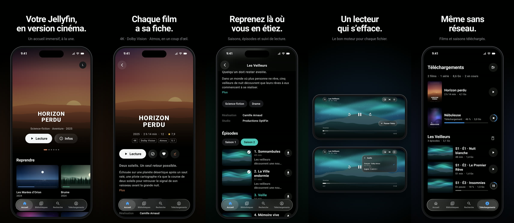

<div align="center">


# OptiFin

**Votre Jellyfin, en version cinéma.**

Client [Jellyfin](https://jellyfin.org) pour iPhone, iPad et Android.

[](https://github.com/AL1X0/OptiFin/actions/workflows/ci.yml)
[](https://github.com/AL1X0/OptiFin/releases/latest)


<a href="https://github.com/AL1X0/OptiFin/blob/main/docs/media/optifin-demo.mp4">
  
</a>

▶ [**Regarder la vidéo**](https://github.com/AL1X0/OptiFin/blob/main/docs/media/optifin-demo.mp4) · 30 s, avec le son



</div>

## En bref

- **Une interface immersive** : carrousel à la une, fiches avec logos et badges 4K · Dolby Vision · Atmos, verre « Liquid Glass ».
- **Un lecteur hybride** : AVPlayer, Media3 ou mpv choisi automatiquement pour chaque fichier, sans transcodage inutile.
- **Pensé pour les séries** : reprise synchronisée, « Passer l'intro », épisode suivant préparé pendant le générique.
- **Hors connexion** : films et saisons téléchargés en arrière-plan, lus sans réseau.
- **iPhone, iPad et Android**, mode sombre soigné, Picture-in-Picture, AirPlay.

## Installer

**iPhone / iPad (SideStore)** : ajoutez cette source dans SideStore (Sources › +) ; chaque nouvelle version y est proposée.

```
https://raw.githubusercontent.com/AL1X0/OptiFin/sidestore/source.json
```

**Android** : `OptiFin-android-arm64-v8a.apk` dans la [dernière Release](https://github.com/AL1X0/OptiFin/releases/latest).

Serveur Jellyfin 10.9 ou plus récent.

## Développement

```bash
flutter pub get && flutter analyze && flutter test
```

Vidéo et captures App Store (`docs/appstore/`, 1320 × 2868) : `bash demo/make_demo.sh`.
Documentation : [architecture](docs/ARCHITECTURE.md) · [décisions](docs/DECISIONS.md) · [matrice des moteurs](docs/TEST_MATRIX.md).
